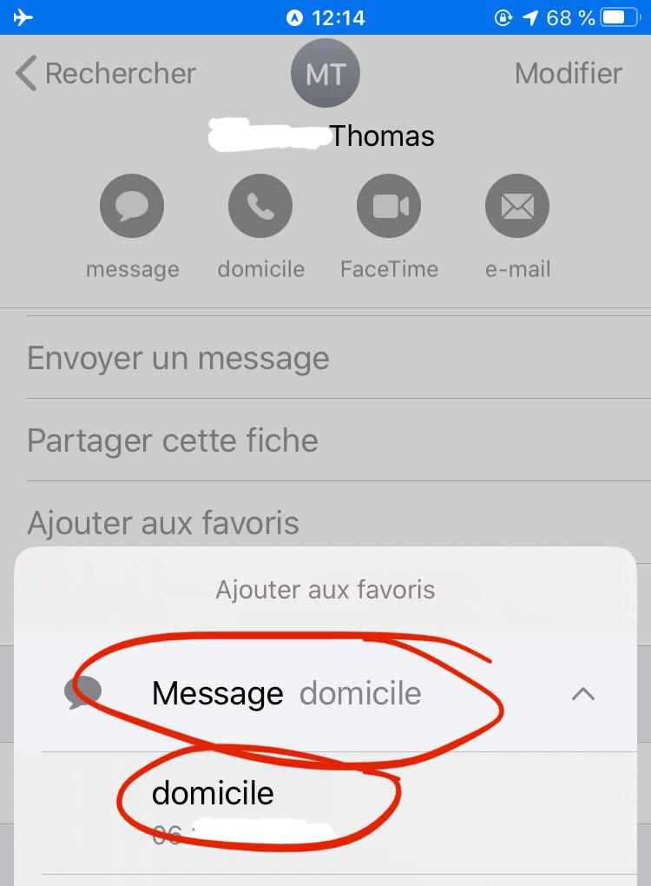
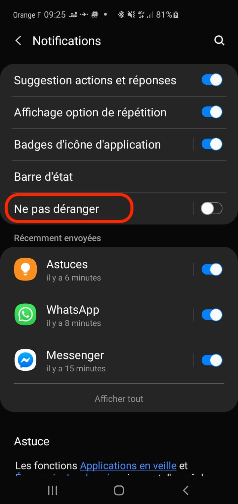
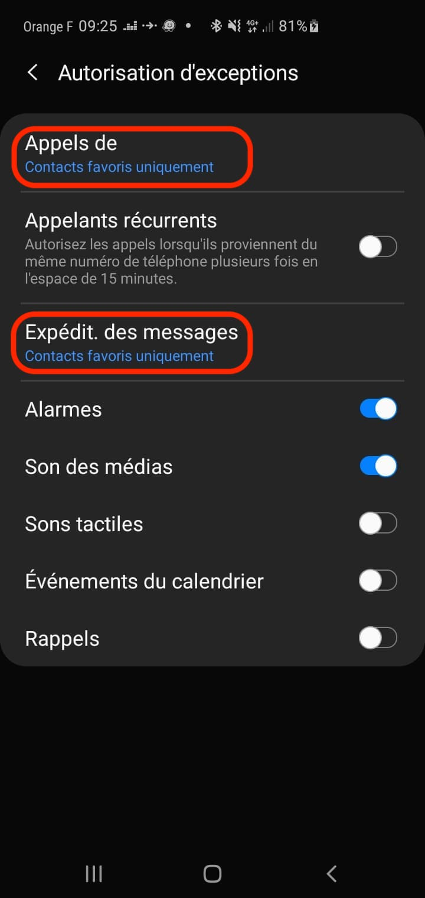
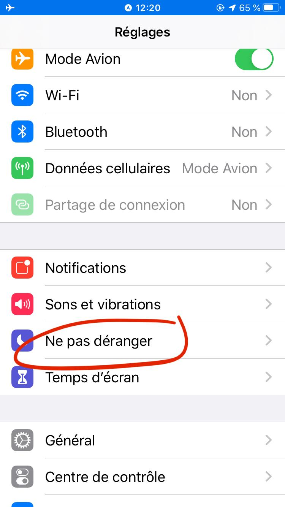
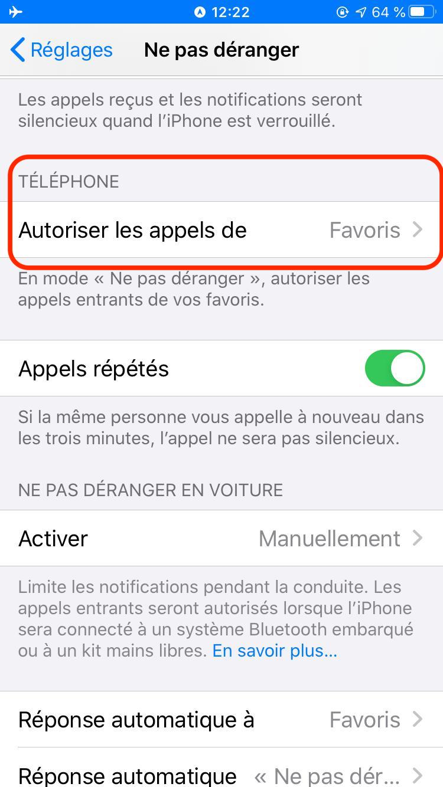

# RedCall pour les bénévoles

## Présentation

RedCall permet aux responsables de l'urgence de recenser les bénévoles de leur(s) unité(s) locale(s) en fonction de leurs compétences. 
Ils peuvent poser une question qui est envoyée par email, SMS et appel téléphonique aux bénévoles, et les réponses que vous renvoyez sont affichées en temps réel sur un tableau de bord de l'opérateur RedCall.

[Comprendre RedCall en moins de 3 minutes](https://www.youtube.com/watch?v=0g8YDprUqg8)

En tant que bénévole, vous pouvez être appelé par votre unité locale à rejoindre des équipages ou/et interventions en fonction de vos intérêts et de vos compétences.

Renseignez-vous auprès de votre unité locale afin de connaître les formations possibles dans l'Action Sociale et l'Urgence Secours.

## Moyens de communication

Les SMS et appels téléphoniques vous sont envoyés lorsqu'une information importante doit vous être transmise, ou lorsqu'un événement nécessite la mobilisation des bénévoles.
Il est impératif de répondre dans les plus brefs délais, même pour remonter votre indisponibilité afin que la Croix Rouge ait la meilleure visibilité possible quant à la mobilisation de ses bénévoles.
 
Vous pouvez également recevoir des emails, pour d'autres communications moins urgentes.

#### Vérifiez vos coordonnées sur Gaia

RedCall s’appuie sur Gaia pour obtenir vos coordonnées et compétences.

Rendez-vous sur [Gaia](https://gaia.croix-rouge.fr) pour vérifier et éventuellement mettre à jours vos coordonnées et compétences.

RedCall se synchronise avec Gaia tous les 30 jours. Vous pouvez demander la mise à jour immediate de RedCall en contactant le support : [support.minutis@croix-rouge.fr](support.minutis@croix-rouge.fr) (un bouton vous permettra prochainement de le faire vous-même depuis l'espace bénévole)

Si vous avez plusieurs numéros de téléphone, il est possible que RedCall n'utilise pas le bon, car RedCall ne sait pas quel téléphone est défini en favori dans Gaia.

Pour ce faire, connectez-vous à RedCall (via [minutis](https://minutis.croix-rouge.fr), puis l'icône gyrophare), vous arrivez sur l'espace bénévole, ou vous pouvez consulter/modifier vos informations.
(Pour les opérateurs RedCall, cette page est accessible par le bouton "Espace Bénévole" en bas de page)

#### Ajouter le numéro de RedCall en favori dans votre téléphone

RedCall utilise le numéro [+33 7 57 90 69 62](tel:+33 7 57 90 69 62) pour émettre les appels téléphoniques et les SMS
et [minutis-no-reply@croix-rouge.fr](mailto:minutis-no-reply@croix-rouge.fr) pour les mails.

Il est impératif d'ajouter ces informations dans une fiche contact, mettre celle-ci en favoris et autoriser les contacts favoris quand votre téléphone est ne mode "ne pas déranger".

Créez un nouveau contact dans votre téléphone, nommé "Déclenchement Operex”, société : "Croix Rouge", avec les coordonnées ci-dessus.

#### Ajouter ensuite ce contact dans vos favoris :
 * Android : cliquez sur l’étoile à droite du nom
 * iPhone : en bas de la fiche contact, cliquez sur “Ajouter aux favoris”, cliquez sur “Message”, puis sélectionnez le numéro. Re-cliquez sur “Ajouter aux favoris”, cliquez sur “Appeler”

  
Cliquez ici pour voir les captures d'écrans

   

#### Autorisez les Appels & SMS des contacts favoris

 * Android: Paramètres -> Notifications -> Ne Pas Déranger -> Authorisation d'exceptions 
    Vérifiez que "Contacts favoris uniquement" est bien affiché pour "Appels de" et "Expédit. des messages"

  
Cliquez ici pour voir les captures d'écrans

 * iPhone : Réglages ->Ne Pas Déranger -> téléphone, “Autoriser les appels de” : Favoris

  
Cliquez ici pour voir les captures d'écrans

## Rappels sur les déclenchements

* Votre téléphone doit rester connecté au réseau et avoir un bon niveau de batterie. N'utilisez pas le "mode avion", utiliser plutôt le mode "ne pas déranger" et le paramétrage décrit dans le chapitre précédent qui permet à vos contacts favoris de vous joindre dans ce mode.
* Si on vous demande le temps qu'il vous faut pour être disponible : il s'agit du temps qu'il vous faut pour arriver à votre point de rassemblement (normalement votre Unité Locale)
* Ne partez pas sans l'ordre explicite de votre cadre
* Lorsque vous rejoignez votre point de rassemblement, pour votre sécurité, il est impératif d'être habillé en civile sans signe distinctif et votre uniforme dans un sac.
* Ne pas solliciter vos cadres inutilement pendant la phase de déclenchement.

# Les différents messages envoyés par RedCall

## Appel téléphonique

Un automate vous lit le message et les réponses possibles.
Utilisez le clavier téléphonique pour sélectionner votre réponse. 0 pour relire le message.

## SMS

### Messages informatif

Lorsque votre unité locale a une information à vous transmettre, aucune intervention de votre part n'est requise.

### Question ouverte

Lorsque votre unité locale a une question à vous poser, vous pouvez y répondre naturellement. Votre réponse apparaîtra automatiquement sur le tableau de bord de votre interlocuteur.

### Question à réponse simple

Lorsque votre unité locale a besoin de monter un équipage, elle va d'abord envoyer un message à tout le monde afin de recenser vos disponibilités. 

Lorsqu'une seule réponse est possible, on vous demandera de répondre par le code de la réponse, dans l'exemple ci-dessous soit F1, soit F2. Votre réponse peut ne pas être prise en compte si vous répondez directement "Dispo." ou "1" car elle nécessite un traitement manuel qui dans l'urgence peut être oublié.

### Question à réponses multiples

De temps en temps, la question posée vous proposera de choisir plusieurs réponses. Dans ce cas, envoyez les codes de votre réponse en les séparant par un espace.

## Question par email

Lorsqu'une question vous est posée par email (que ce soit à choix multiple ou non), vous recevez un lien qui permet d'y répondre.

Cliquez simplement sur les réponses qui vous conviennent.

